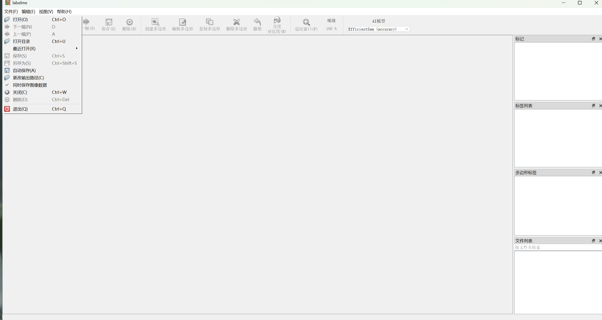
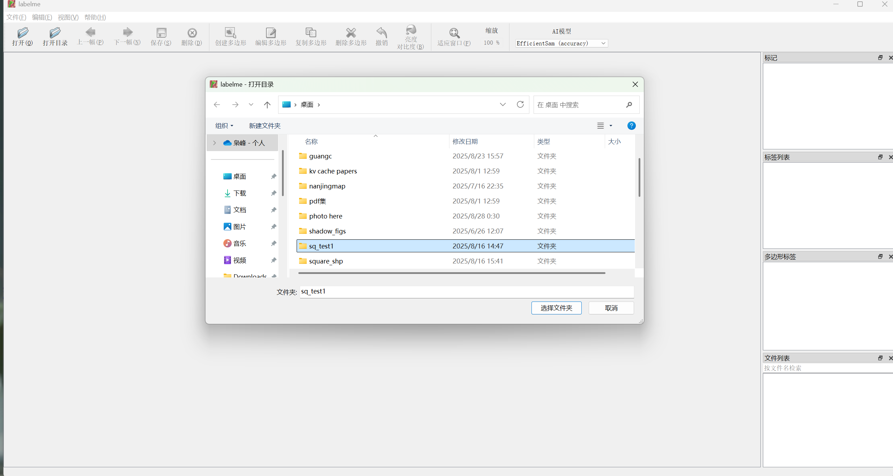
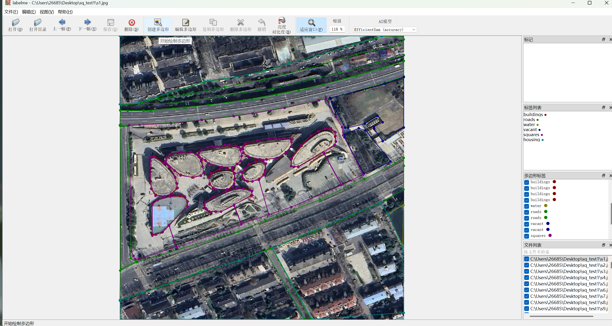
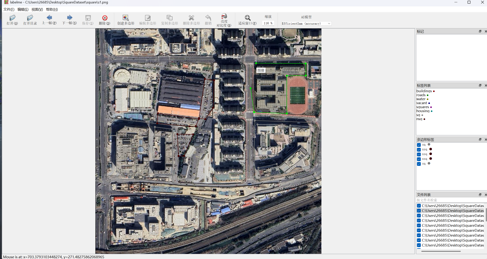
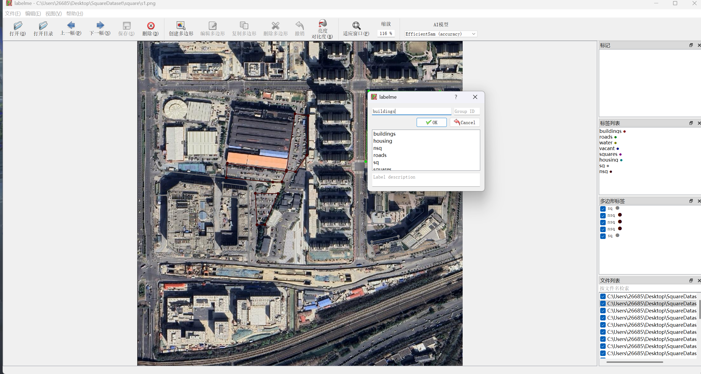
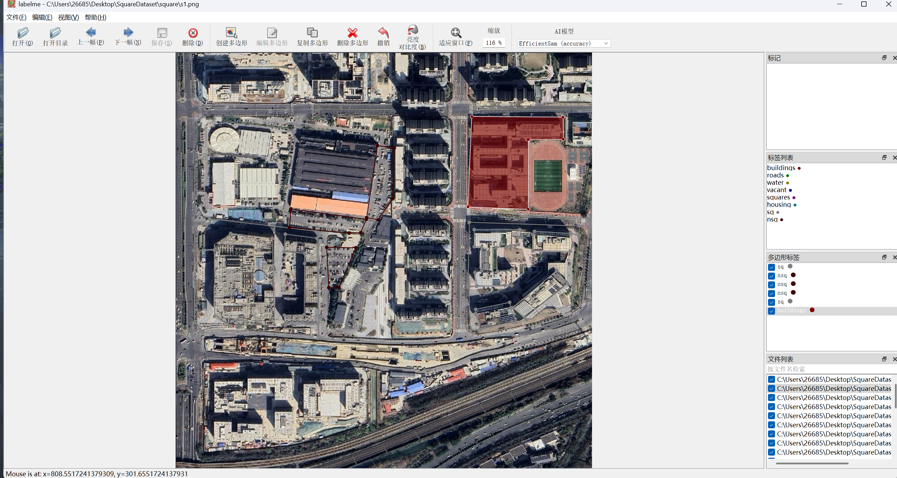
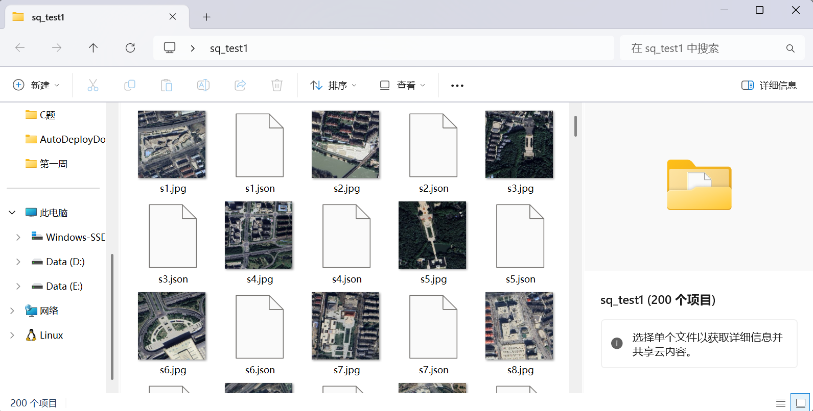

# Labelme

[Label官网](https://labelme.io/)

下载软件，即开即用

Build your image dataset for AI.

## download

Download app

解压，Labelme.exe

## Steps
1.文件-自动保存打开，同时保存图像数据关闭（每次开始前需手动设置）



2.打开目录-选择图像/数据集所在文件夹



3.创建多边形



4.描点围成图形（多边形）



5.打标签



6.编辑多边形

点击"编辑多边形"，选中想要修改的多边形区域进行修改



7.（如果未自动保存），保存结果（.json格式文件），结果和图像存储在同一文件夹下



8.原图像 + 标注结果.json -> 掩膜图像

img2mask.py
```py
import os
import json
import numpy as np
import cv2

import matplotlib.pyplot as plt

def img2mask(dir, img):
    # 这里修改原图像文件路径
    img_path = f'C:\\Users\\26685\\Desktop\\{dir}\\{img}.jpg'
    img_bgr = cv2.imread(img_path)

    plt.imshow(img_bgr[:,:,::-1])
    plt.show()

    img_mask = np.zeros(img_bgr.shape[:2])

    plt.imshow(img_mask)
    # plt.show()

    # 这里修改json文件路径
    labelme_json_path = f'C:\\Users\\26685\\Desktop\\{dir}\\{img}.json'
    with open(labelme_json_path, 'r', encoding='utf-8') as f:
        labelme = json.load(f)
    print(labelme.keys())

    # 这里修改类别标签和相应类型/颜色
    class_info = [
        {'label': 'buildings', 'type': 'polygon', 'color': 1},
        {'label': 'roads', 'type': 'polygon', 'color': 2},
        {'label': 'water', 'type': 'polygon', 'color': 3},
        {'label': 'squares', 'type': 'polygon', 'color': 4},
        {'label': 'vegetation', 'type': 'polygon', 'color': 5},
        {'label': 'vacant', 'type': 'polygon', 'color': 6},
        {'label': 'playground', 'type': 'polygon', 'color': 7},
        {'label': 'greenland', 'type': 'polygon', 'color': 8},
        {'label': 'park', 'type': 'polygon', 'color': 9},
        {'label': 'parking', 'type': 'polygon', 'color': 10},
        {'label': 'housing', 'type': 'polygon', 'color': 11},
        {'label': 'workland', 'type': 'polygon', 'color': 12},
        {'label': 'block', 'type': 'polygon', 'color': 13},
    ]

    for one_class in class_info:  # 按顺序遍历每一个类别
        for each in labelme['shapes']:  # 遍历所有标注，找到属于当前类别的标注
            if each['label'] == one_class['label']:
                if one_class['type'] == 'polygon':  # polygon 多段线标注

                    # 获取点的坐标
                    points = [np.array(each['points'], dtype=np.int32).reshape((-1, 1, 2))]

                    # 在空白图上画 mask（闭合区域）
                    img_mask = cv2.fillPoly(img_mask, points, color=one_class['color'])

                elif one_class['type'] == 'line' or one_class['type'] == 'linestrip':  # line 或者 linestrip 线段标注

                    # 获取点的坐标
                    points = [np.array(each['points'], dtype=np.int32).reshape((-1, 1, 2))]

                    # 在空白图上画 mask（非闭合区域）
                    img_mask = cv2.polylines(img_mask, points, isClosed=False, color=one_class['color'],
                                             thickness=one_class['thickness'])

                elif one_class['type'] == 'circle':  # circle 圆形标注

                    points = np.array(each['points'], dtype=np.int32)

                    center_x, center_y = points[0][0], points[0][1]  # 圆心点坐标

                    edge_x, edge_y = points[1][0], points[1][1]  # 圆周点坐标

                    radius = np.linalg.norm(np.array([center_x, center_y] - np.array([edge_x, edge_y]))).astype(
                        'uint32')  # 半径

                    img_mask = cv2.circle(img_mask, (center_x, center_y), radius, one_class['color'],
                                          one_class['thickness'])

                else:
                    print('未知标注类型', one_class['type'])

    plt.imshow(img_mask)
    plt.show()

    print(img_mask)
    mask_path = img_path.split('.')[0] + '.png'
    cv2.imwrite(mask_path, img_mask)

    # 这里修改掩膜图像结果保存路径
    mask_img = cv2.imread(f'C:\\Users\\26685\\Desktop\\{dir}\\{img}.png')
    plt.imshow(mask_img[:,:,0])
    # plt.show()

if __name__ == '__main__':
    # 批量化处理结果，从s1.jpg处理到到s100.jpg
    # 如果只想处理单张图像单独调用一下img2mask()函数即可
    st = 1
    ed = 100
    dir = 'sq_test1'
    for idx in range(st, ed+1):
        img = f's{idx}'
        img2mask(dir, img)

```

