# UPS-Identify
The python package for semantic segmentation and recognition of urban public spaces in remote sensing images

## platform
本实验运行在云GPU平台[Featurize](https://featurize.cn)上运行，使用显卡4090(3090应该也可以)

Featurize没用过？[教学](./docs/featurize.md)

点进work文件夹，点左上角的加号新建一个terminal

// （这里因为我的work文件夹里有东西了，就新建了一个work2文件夹做示范，正常用work文件夹就OK了）

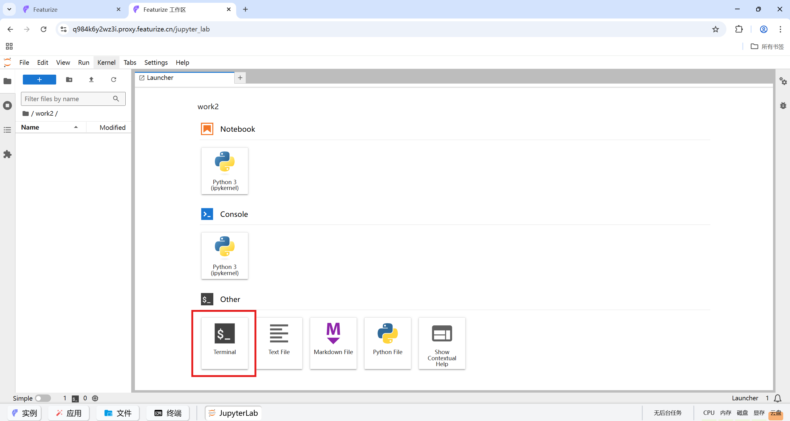

## git clone
在终端里输入
```sh
git clone https://github.com/cleardream20/UPS-Identify.git
cd UPS-Identify # 如果不在work文件夹下先 cd work
```

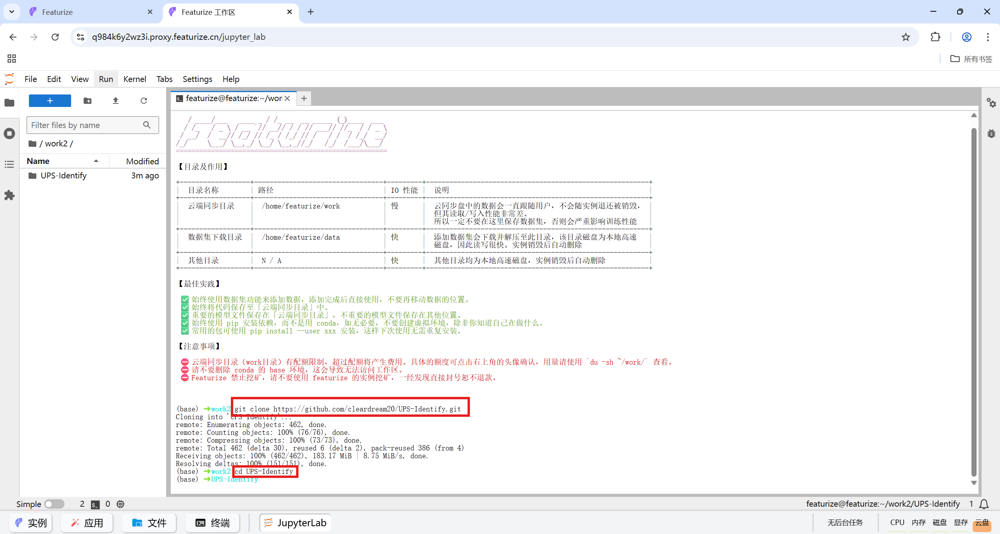

这一步只需要进行一次，后面这些东西都会被保存在work文件夹里，就不用再做了

然后点进UPS-Identify文件夹里

## Steps

### Setup all in one 环境配置
在终端中输入
```sh
bash all_in_one.sh
```

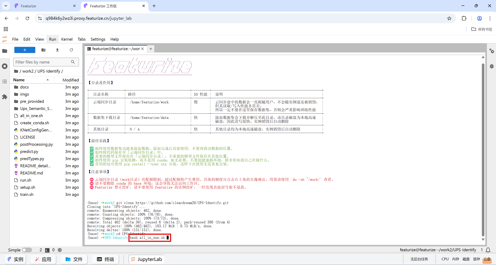

直到看到"**所有操作完成**"即完成环境配置

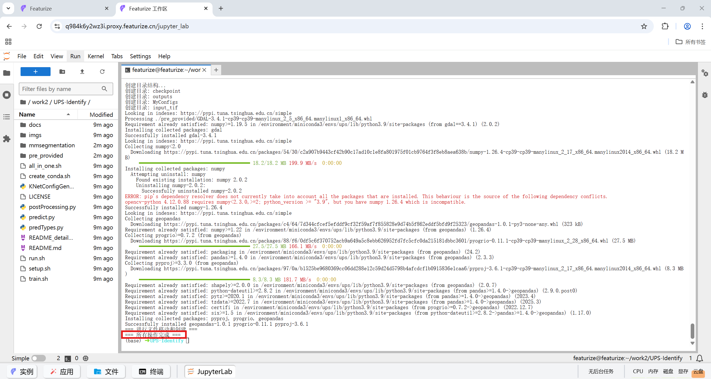

### Train / Predict / PostProcessing
将训练/预测/后处理操作都集成在run.sh文件里

在终端里输入
```sh
bash run.sh
```

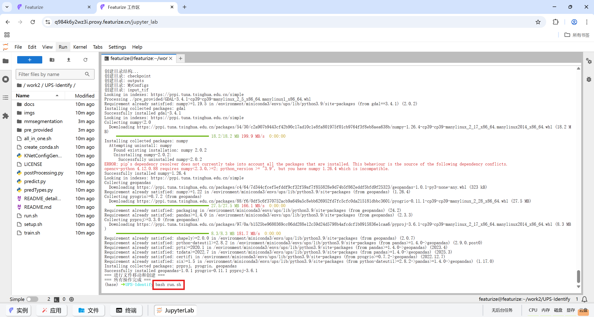

会出现类似下面的"菜单"
```sh
(ups) ➜ UPS-Identify bash run.sh
=================================
      请选择要执行的操作
=================================
选项:
  train    - 训练模型 (执行 train.sh)
  pred     - 进行预测 (执行 predict.py)
  postp    - 后处理 (执行 postProcessing.py)
  exit     - 退出程序
=================================
请输入您的选择 (train/pred/postp/exit):

# 输入train进行训练，输入pred进行单张图片预测，输入postp进行后处理全流程，输入exit退出
```

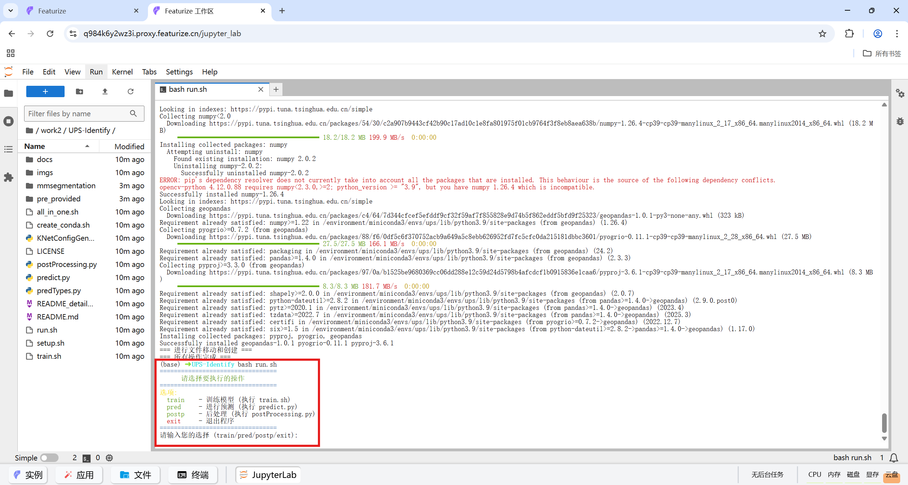

### Train
下面详解训练的相关操作

相关参数/路径在文件train.sh里，点击该文件检查路径是否正确（新手直接使用默认的路径就可以，熟悉后可以自定义）
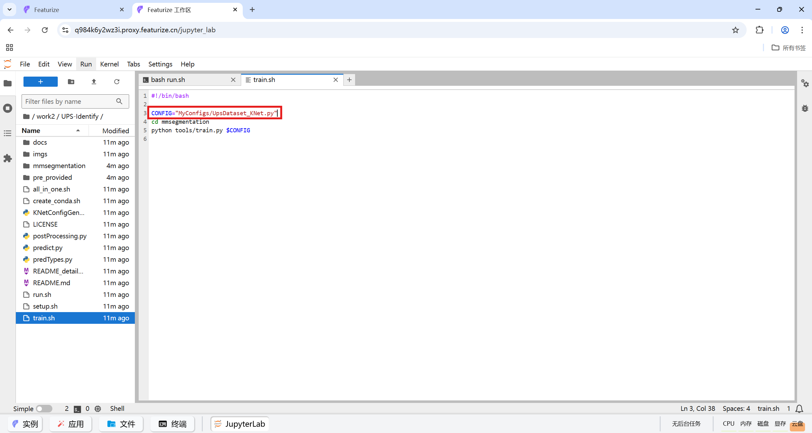

输入选择：**train**
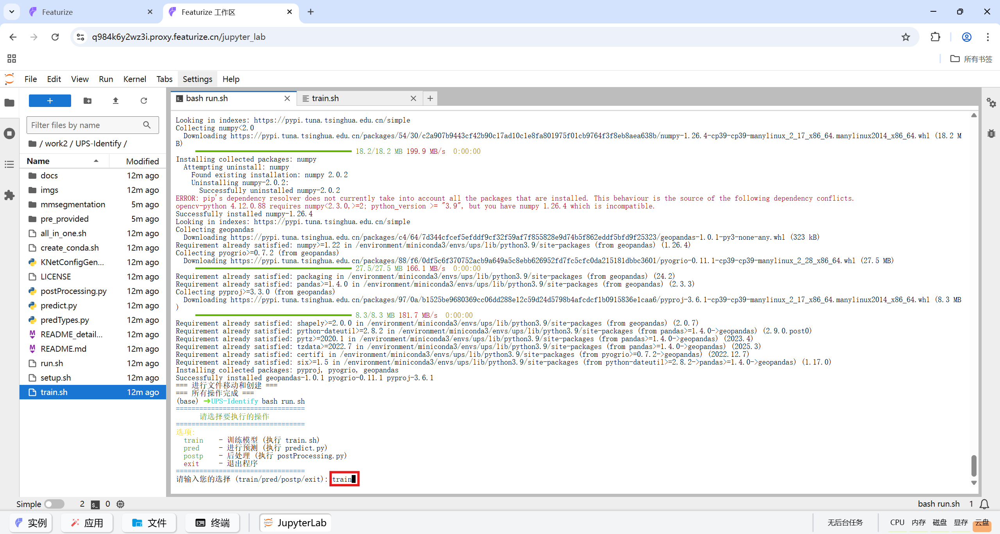

观察到类似如下的输出，说明训练过程成功进行
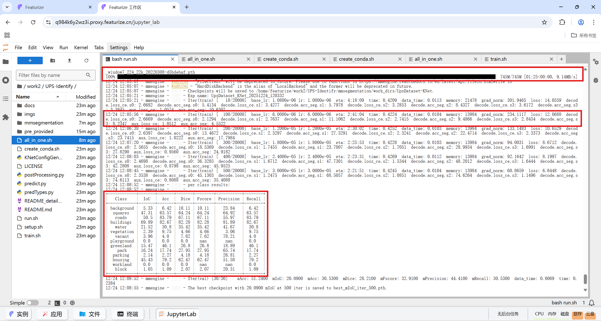

[xx/20000]表示训练轮次，等到20000次全部训练完成，或者训练轮次差不多是，按"Ctrl-C"中止训练，进行早停
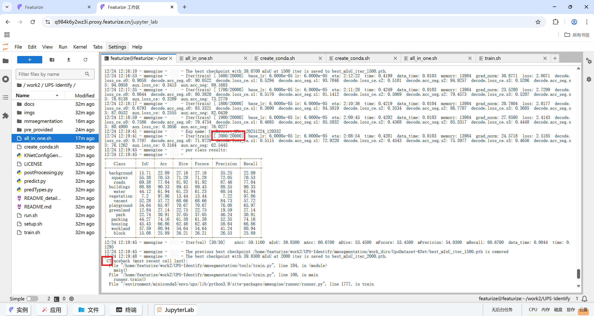

训练结果：模型参数文件（.pth文件）保存在`./mmsegmentation/work_dirs/UpsDataset-KNet`文件夹下

如下图中的`best_mIoU_iter_2000.pth`
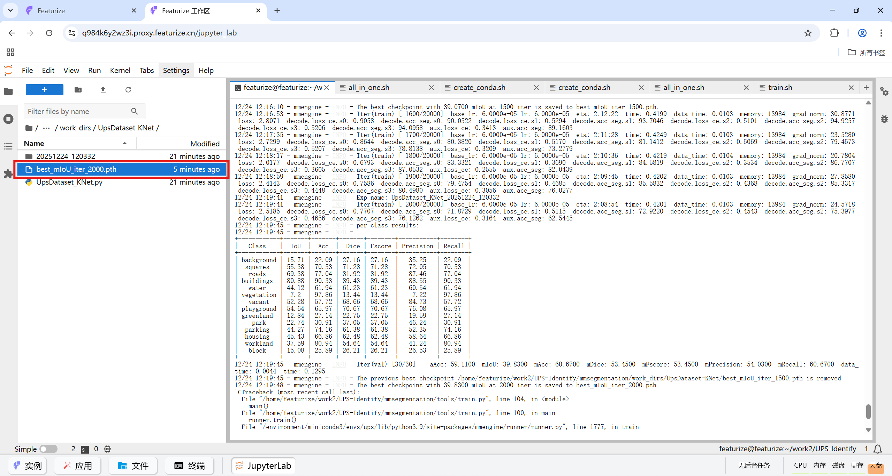

复制你所想要使用的.pth文件的路径（如上面说的`./mmsegmentation/work_dirs/UpsDataset-KNet/best_mIoU_iter_2000.pth`），在后面的预测和后处理过程中需要用到

### PostProcessing
后处理相关参数和路径在文件`postProcessing.py`里（直接翻到最后几行）
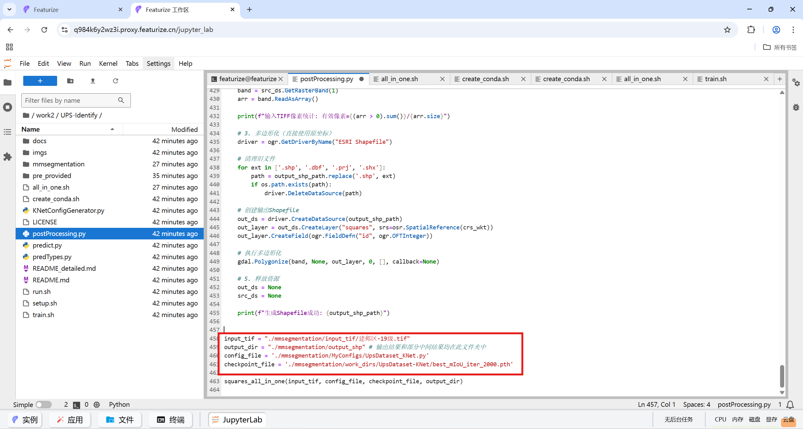

相关路径含义为
| 路径 | 含义 |
|--|--|
| input_tif | 待预测的/输入的tif文件路径 |
| output_dir | 相关输出文件和结果所在文件夹 |
| config_file | 模型配置文件路径 |
| checkpoint_file | 模型参数文件路径 |

需要修改的一般有`input_tif`（重点是名字）和`checkpoint_file`（训练生成的.pth的路径，右键.pth文件然后`copy Path`即可复制路径）

---
在`./mmsegmentation/input_tif`文件夹里上传待预测的tif文件
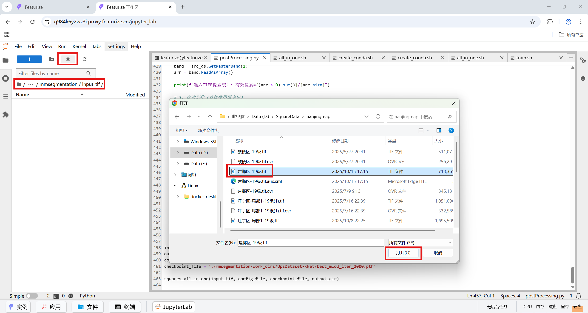

点击Upload
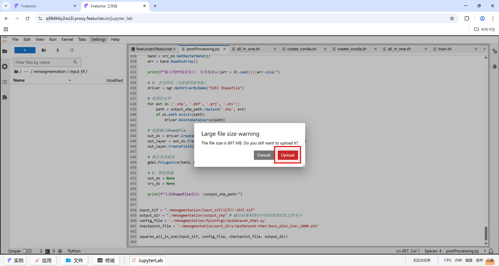

等待上传完毕
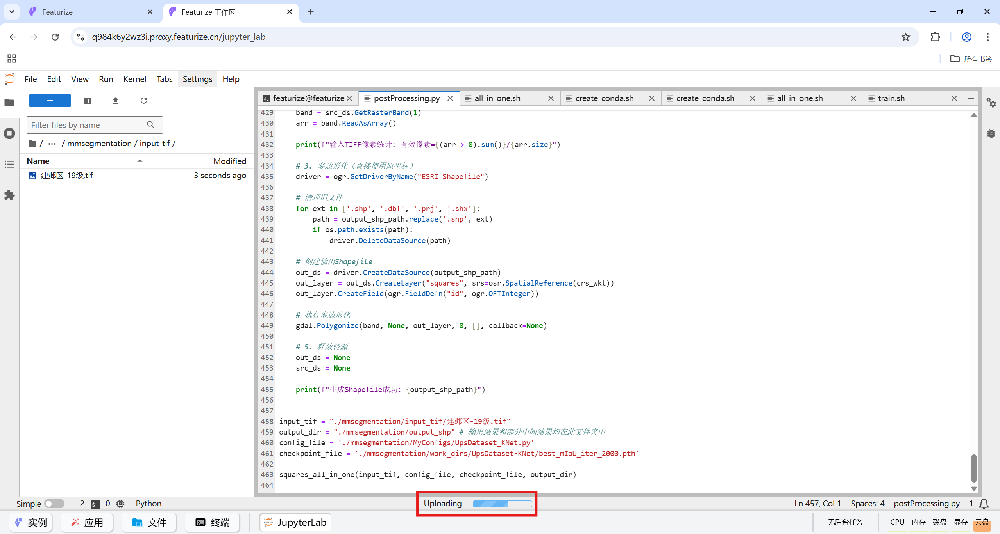

---
再运行`run.sh`，选择输入**postp**
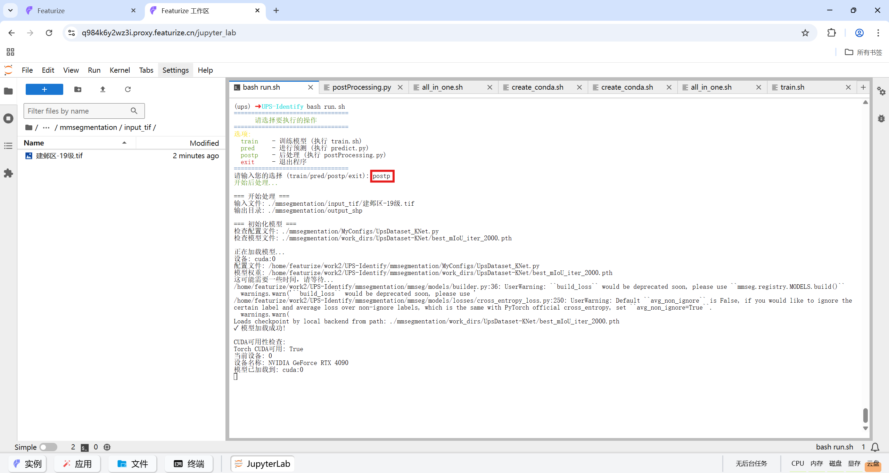

等待后处理运行完毕
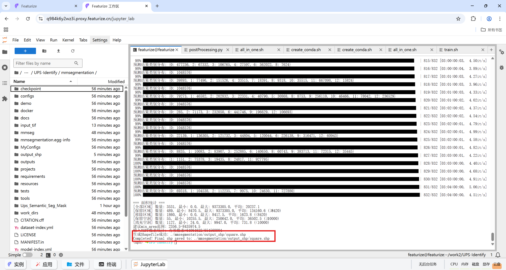

最终输出结果保存在`./mmsegmentation/output_shp`中
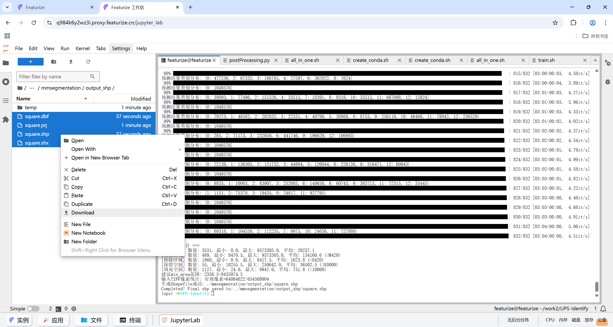

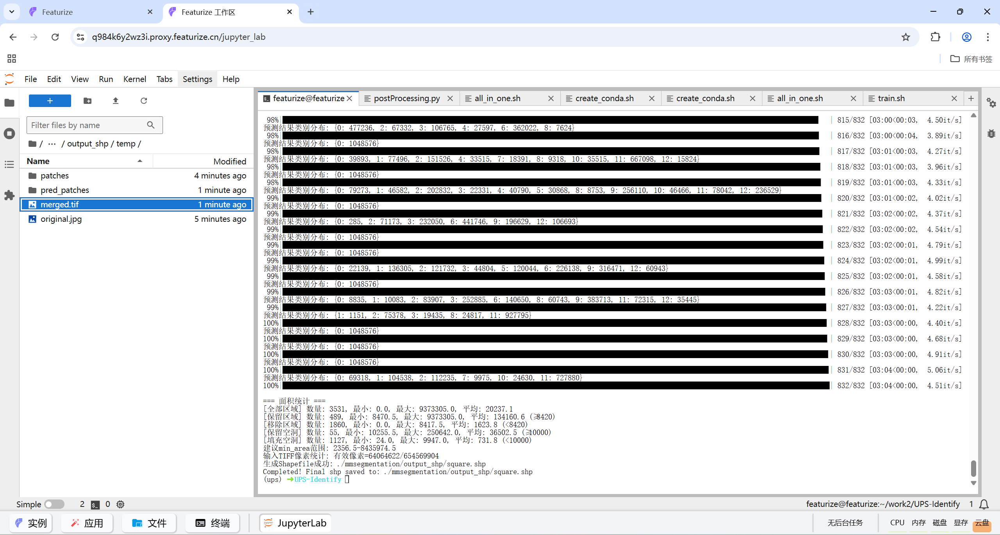

下载4个和shp相关的文件，和`merge.tif`就OK（右键文件，点击download）


